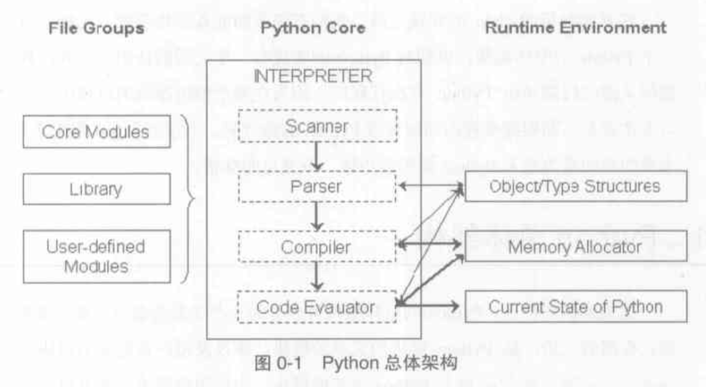

# CPython 架构

我们正式进入 CPython 的源代码分析。

## 代码

静态分析，代码的组织。

	├── Include			#所有头文件
	├── Lib 			#Python编写的标准库
	├── Modules			#C编写的标准库
	├── Objects			#C实现的Python对象，包括类型对象 int list 等
	├── Parser			#语法分析 和 词法分析 
	├── Python			#编译器和虚拟机
	...

在Python中一切皆对象，那么当我们新建一个实例、类在CPython中怎么表示的呢？**Objects** 目录就是CPython中所有对象的实现，从中我们可以看到在CPython中怎样表示Python的各种类型。

## 运行时

CPython 在运行时可以分成是三个部分，**源代码/模块系统** **解释器** **运行时系统** 如下图：

*摘自 pythong源码剖析*

* File Groups
	* Core Modules 核心python模块
	* Library 三方包
	* User-defined Modules 用户自定义模块
* Python Core
	* Scanner 词法分析
	* Parser 语法分析
	* Compiler 编译器
	* Code Evauator 虚拟机
* Runtime Environment 
	* Object/Types Structures 对象/类型系统
	* Memory Allocator 内存分配器
	* Current State of Python 运行时状态信息

**词法分析器** 将源代码切分为 token， **语法分析** 形成 抽象语法树，**编译器** 生成指令集合（Python字节码），最后由 **虚拟机** 执行。

其中 **内存分配器** 就是对 C 中 malloc 函数的一层封装。**对象/类型系统** 包含了 Python 中的各种内建对象以及用户自定义的类对象和实例对象。

