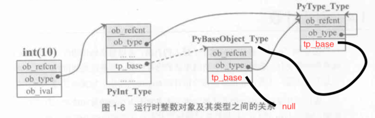

# Python 对象在CPython中的表示

我们知道在Python中一切皆对象，而CPython又是C写的，那么怎么用C来表示Python中的对象及对象间的关系呢。

Python对象就是C的结构体在堆上申请的一块内存。

### 对象的基石 PyObject

在源码中有如下定义：

	//PyObject_HEAD 的宏
	#difine PyObject_HEAD 
		int ob_refcnt;
		struct _typeobject *ob_type;
	
	#define PyObject_VAR_HEAD		\
		PyObject_HEAD			\
		int ob_size;
		
	typedef struct _object {
		PyObject_HEAD	
	} PyObject;
	
	typedef struct {
		PyObject_VAR_HEAD
	} PyVarObject;

	
先看 PyObject 表示定长对象，其中 ob_refcnt 是引用计数，应用在内存管理机制。ob_type 保存着对象的类型信息。而 PyVarObject 在替换后比 PyObject 多出一个成员：ob_size，它表示类似 list dict 这种变长对象的元素个数。

### 类型对象 PyTypeObject

	typedef struct _typeobject {
		PyObject_VAR_HEAD
		const char *tp_name; /* For printing, in format "<module>.<name>" */
		Py_ssize_t tp_basicsize, tp_itemsize; /* For allocation */
	
		/* Methods to implement standard operations */
		destructor tp_dealloc;
		printfunc tp_print;
		...
		/* More standard operations (here for binary compatibility) */
		hashfunc tp_hash;
		ternaryfunc tp_call;
		...
		struct _typeobject *tp_base;
		...
	} PyTypeObject;

这个结构体很复杂，每一个Python对象对应的结构体都有这个成员，甚至它自己。主要包含四个信息：

* tp_name 类型名，也就是类的名称
* tp_basicsize tp_itemsize 这个类的实例占用的内存大小信息
* 函数指针，该类型拥有的函数
* tp_base 类型的类型信息

### 对象的创建

面向对象编程语言中有两大概念： 类 和 对象，由类创建对象。Python中的对象也是这样创建的。

例如在 CPython 中 PyInt_Type 就对应这个 Python 中 int 这个內建类，当我们创建一个 int 对象时，Python 就会根据 PyInt_Type 这个类型对象创建一个 int 对象。一个类型对象中会存有 tp_new tp_init 这两个函数指针， 一个负责申请内存 一个负责初始化。

我们都知道一个对象所表示出的行为，也就是它的方法信息是在它的类中存储的，CPython 也是如此。PyInt_Type 这个类型对象中的函数指针，就是 int 对象所具有的方法。在 PyTypeObject 中有三组重要的函数，tp_as_number tp_as_sequence tp_as_mapping （三个结构体指针，结构体中定义的是函数指针） 它们分别对应 数值对象 序列对象 关联对象 的基本操作，例如 int 对象的加法操作，序列对象的 [] 操作等。

### 类型的类型

那我们怎么样创建一个类型对象呢（怎样定义一个类），类型对象的类型是什么呢？

每一个类型对象都保存着一个 PyType_Type 的指针。类型对象的类型是 PyType_Type 对象，这样也就出来了一个元类型。所有类型的类型。

图中可以清晰的看到一个 Python int 对象在运行时的表示。其中 ob_type 是当前对象的 类型，ob_base 是当前对象的基类(继承自谁）。

* int(10) int对象，如 a=10 a就是一个int对象
* PyInt_Type 在Python中对应int这个类
* PyBaseObject_Type 基类，对应这Python中的 object
* PyType_Type 类型对象的类型，它的类型也是它自己。对应Python中的type

由图我们可以看到一个Python对象的整体表示。

### 多态

在Python层面有两个基类 object type，在CPython中两个基类则是 PyObject 和 PyTypeObject，这两个基类实现了Python的多态特性，因为这两个对象的头部是相同的，那么我们通过泛型指针就实现了对象的多态特性。

